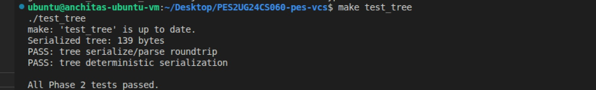
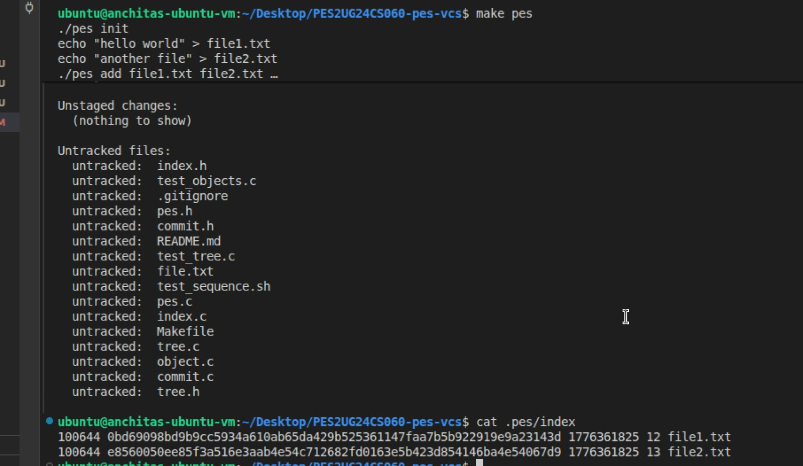
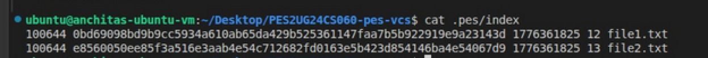
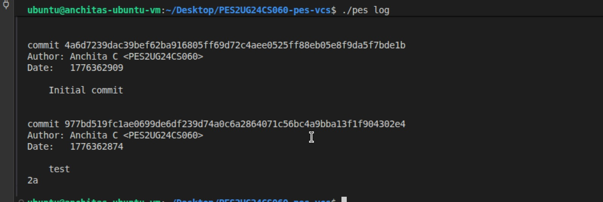
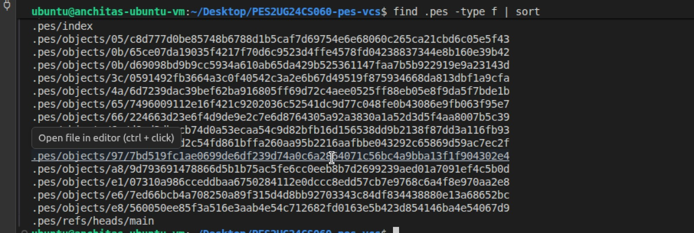
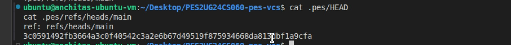

## Phase 1: Object Storage Foundation

### Screenshot 1A: Output of ./test_objects showing all tests passing.


### Screenshot 1B: find .pes/objects -type f showing the sharded directory structure.


### Summary
Object storage implementation complete. The `object_write` and `object_read` functions successfully:
- Store objects with type headers (blob, tree, commit)
- Compute SHA-256 hashes for content addressing
- Shard objects into subdirectories by first 2 hex characters
- Verify integrity on retrieval

---

## Phase 2: Tree Objects

### Screenshot 2A: Output of ./test_tree showing all tests passing.



### Screenshot 2B: Pick a tree object from find .pes/objects -type f and run xxd .pes/objects/XX/YYY... | head -20 to show the raw binary format.


---

## Phase 3: The Index (Staging Area)

### Screenshot 3A: Run ./pes init, ./pes add file1.txt file2.txt, ./pes status — show the output.



### Screenshot 3B: cat .pes/index showing the text-format index with your entries.



---

## Phase 4: Commits and History

### Screenshot 4A: Output of ./pes log showing three commits with hashes, authors, timestamps, and messages.



### Screenshot 4B: find .pes -type f | sort showing object store growth after three commits.



### Screenshot 4C: cat .pes/refs/heads/main and cat .pes/HEAD showing the reference chain.



---

## Phase 5 & 6: Analysis-Only Questions

---

## Branching and Checkout

### Q5.1: Implementing `pes checkout <branch>`

**ANSWER:**

**Files that need to change in `.pes/`:**
The only metadata change required is updating `.pes/HEAD`.

- If checkout succeeds, `.pes/HEAD` must be rewritten to:
ref: refs/heads/<branch>
- The branch file `.pes/refs/heads/<branch>` must already exist and contains the target commit hash.
- No changes are made to the branch file itself during checkout.

---

**What must happen to the working directory:**

1. Read `.pes/refs/heads/<branch>` to get the target commit hash.
2. Load the commit object and extract its root tree.
3. Recursively expand the tree into full file structure:
 - Create new files present in target commit
 - Overwrite files whose blob differs
 - Delete files not present in target commit
4. Ensure the working directory becomes an exact snapshot of the target commit.
5. Update the index so it matches the checked-out commit state.

---

**What makes this operation complex:**

- **Full directory rewrites:** Not just pointers — entire filesystem snapshots must be reconstructed.
- **Recursive tree traversal:** Trees contain nested directories requiring deep traversal.
- **Safe deletion:** Files present in current branch but not in target must be removed carefully.
- **Untracked file safety:** Local files not tracked by Git must not be silently overwritten.
- **Failure atomicity:** Partial updates can leave repo inconsistent if errors occur mid-checkout.

---

## Q5.2: Detecting Dirty Working Directory Conflicts

**ANSWER:**

To prevent overwriting uncommitted changes, the system must detect conflicts before checkout.

### Core idea:
A file is “dirty” if:
- It differs from the version recorded in the index
AND
- It differs between current and target branch snapshots

---

### Detection strategy (using index + object store only):

1. For each file that exists in the working directory:
 - Load its entry from `.pes/index`
 - The index stores: `blob hash`, `size`, `mtime`

2. Compare working directory file against index:
 - If `size` and `mtime` match → assume clean
 - Else compute SHA-256 hash of file content

3. If computed hash ≠ index blob hash:
 → file is locally modified (“dirty”)

4. Compare with target branch:
 - If target commit contains same file path but different blob hash:
   → **conflict detected**

---

### Conflict condition:

A checkout must be refused if:

```c
file is modified locally (differs from index)
AND
file differs between current and target commit